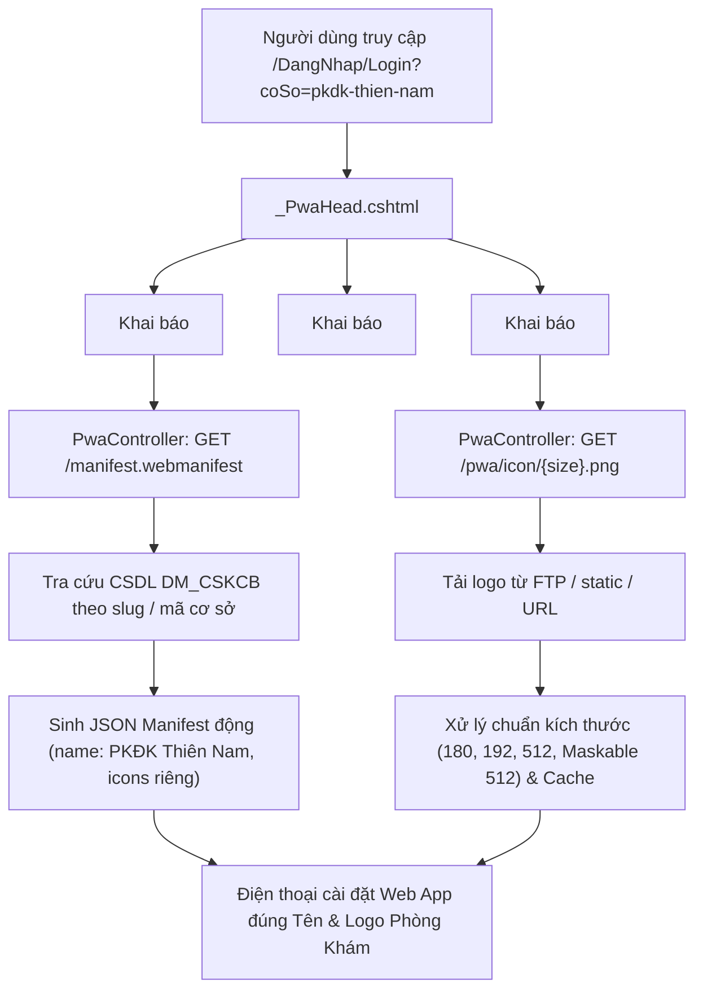

# Báo Cáo & Tài Liệu Kỹ Thuật: Tùy Biến Tên và Logo PWA Theo Từng Cơ Sở Y Tế

Tài liệu này ghi lại chi tiết toàn bộ quá trình khảo sát, giải pháp kiến trúc và các bước triển khai đã thực hiện để chuyển đổi cơ chế cài đặt PWA từ cấu hình tĩnh (**HisSoft**) sang cấu hình động theo từng phòng khám (**PKĐK Thiên Nam**).

> **Nguồn:** nội dung dưới đây cóp tay từ nhánh `loky_6` (commit `68b02a0`) sang nhánh bàn giao
> `namnhat_2209_BanGiao` ngày 2026-09-22. Quyết định kiến trúc được chốt lại ở
> [ADR 0043](adr/0043-manifest-pwa-sinh-dong-theo-co-so.md).
>
> **Khác với bản gốc `loky_6` ba chỗ:** ① file này chuyển từ `wwwroot/` sang `docs/` — nằm trong
> `wwwroot` là ai cũng mở được bằng URL; ② bỏ biến `maCoSo` không dùng trong `_PwaHead.cshtml`;
> ③ **bỏ hẳn `System.Drawing`, đổi sang `SkiaSharp` 3.119.0** — xem mục 6.

---

## 1. Hiện Trạng Ban Đầu & Vấn Đề

- **Yêu cầu của người dùng:** Khi bệnh nhân/người dùng vào cổng phòng khám (ví dụ: *PKĐK Thiên Nam*) và nhấn **"Cài đặt Ứng dụng vào máy"**, ứng dụng cài về màn hình điện thoại phải hiển thị đúng tên **"PKĐK Thiên Nam"** và **Logo của phòng khám**, thay vì hiển thị tên và logo mặc định của phần mềm gốc là *HisSoft*.
- **Nguyên nhân gốc rễ:**
  1. File `manifest.webmanifest` trong `wwwroot` được cấu hình dạng tĩnh (hardcoded) với `name: "HisSoft — Sixos"`, `short_name: "HisSoft"`, và trỏ tới bộ icon mặc định `/static/icon-192.png`, `/static/icon-512.png`.
  2. File partial `_PwaHead.cshtml` khai báo đường dẫn tĩnh `<link rel="manifest" href="~/manifest.webmanifest" />` và thẻ iOS tĩnh `<meta name="apple-mobile-web-app-title" content="HisSoft" />`.
  3. Khi trình duyệt (Chrome trên Android hoặc Safari trên iOS) kích hoạt tính năng cài đặt PWA, trình duyệt luôn đọc file manifest tĩnh này dẫn đến ứng dụng cài đặt luôn mang tên và logo HisSoft.

---

## 2. Giải Pháp Triển Khai (Dynamic PWA Architecture)



---

## 3. Chi Tiết Các Bước Thực Hiện

### Bước 1: Khảo sát dữ liệu và chuẩn bị bộ icon chuẩn của phòng khám
- Truy vấn cơ sở dữ liệu `DM_CSKCB` với mã cơ sở `77121` (slug: `pkdk-thien-nam`):
  - **Tên cơ sở:** `PKĐK Thiên Nam`
  - **Logo đường dẫn FTP:** `/anh/77121/logo/images.png`
- Tải và xử lý bộ icon đạt chuẩn PWA đặt tại `wwwroot/static/`:
  - `icon-pkdk-thien-nam-192.png` (192x192 px - chuẩn Android)
  - `icon-pkdk-thien-nam-512.png` (512x512 px - chuẩn màn hình HD)
  - `icon-pkdk-thien-nam-maskable-512.png` (512x512 px kèm 20% safe zone margin chống bo viền)
  - `apple-touch-icon-pkdk-thien-nam-180.png` (180x180 px - chuẩn iOS Apple)

---

### Bước 2: Xây dựng Bộ Điều Khiển PWA Động ([`PwaController.cs`](../SixosPwa/Controllers/PwaController.cs))

Tạo controller chuyên biệt đảm nhiệm việc phân giải cơ sở y tế và trả về tài nguyên PWA tương ứng:

1. **Endpoint `GET /manifest.webmanifest` & `GET /manifest.json`:**
   - Đọc tham số `?coSo=...`, cookie `pwa_co_so`, `ClaimMaCoSo` hoặc Referer header.
   - Tìm kiếm cơ sở trong CSDL `_dbContext.DMCSKCBs`.
   - Sinh payload Manifest JSON động:
     ```json
     {
       "id": "/?coSo=pkdk-thien-nam",
       "name": "PKĐK Thiên Nam",
       "short_name": "PKĐK Thiên Nam",
       "description": "Cổng thông tin và quản lý hồ sơ bệnh nhân PKĐK Thiên Nam",
       "lang": "vi",
       "dir": "ltr",
       "start_url": "/DangNhap/Login?coSo=pkdk-thien-nam",
       "scope": "/",
       "display": "standalone",
       "orientation": "any",
       "background_color": "#ffffff",
       "theme_color": "#3854A4",
       "icons": [
         {
           "src": "/pwa/icon/192.png?coSo=pkdk-thien-nam",
           "sizes": "192x192",
           "type": "image/png",
           "purpose": "any"
         },
         {
           "src": "/pwa/icon/512.png?coSo=pkdk-thien-nam",
           "sizes": "512x512",
           "type": "image/png",
           "purpose": "any"
         },
         {
           "src": "/pwa/icon/maskable-512.png?coSo=pkdk-thien-nam",
           "sizes": "512x512",
           "type": "image/png",
           "purpose": "maskable"
         }
       ]
     }
     ```
   - Trả về header `Cache-Control: no-cache, no-store, must-revalidate` để trình duyệt luôn cập nhật manifest mới.

2. **Endpoint `GET /pwa/icon/{tenIcon}`:**
   - Xử lý các kích thước `180.png`, `192.png`, `512.png`, `maskable-512.png`.
   - Ưu tiên đọc từ cache bộ nhớ `IMemoryCache` (24h) hoặc file tĩnh đã dựng sẵn.
   - Tự động download logo phòng khám từ kho FTP/URL và dùng thuật toán đồ họa căn giữa trên nền vuông đạt chuẩn.

---

### Bước 3: Cập nhật [`_PwaHead.cshtml`](../SixosPwa/Views/Shared/_PwaHead.cshtml)

Cập nhật mã nhúng `<head>` để tự động gắn query cơ sở vào manifest và thẻ meta cho iOS:

```razor
@{
    string? slugCoSo = ViewBag.SlugCoSo as string ?? ViewData["Slug"] as string;
    string? maCoSo = ViewBag.MaCoSo as string ?? ViewData["MaCoSo"] as string;
    string? tenCoSo = ViewBag.TenCoSo as string ?? ViewData["TenCoSo"] as string;

    if (string.IsNullOrWhiteSpace(slugCoSo))
    {
        slugCoSo = Context.Request.Query["coSo"].FirstOrDefault();
    }
    if (string.IsNullOrWhiteSpace(slugCoSo))
    {
        slugCoSo = Context.Request.Cookies["pwa_co_so"];
    }
    if (string.IsNullOrWhiteSpace(slugCoSo))
    {
        slugCoSo = User.FindFirst(SixosPwa.Services.Partner.LuongCongBenhNhan.ClaimMaCoSo)?.Value;
    }

    var coSoQuery = !string.IsNullOrWhiteSpace(slugCoSo) ? $"?coSo={Uri.EscapeDataString(slugCoSo)}" : "";
    var manifestUrl = $"/manifest.webmanifest{coSoQuery}";
    var appTitle = !string.IsNullOrWhiteSpace(tenCoSo) ? tenCoSo : "HisSoft";
    var iconUrl = !string.IsNullOrWhiteSpace(slugCoSo) ? $"/pwa/icon/192.png{coSoQuery}" : "/static/icon-192.png";
    var appleIconUrl = !string.IsNullOrWhiteSpace(slugCoSo) ? $"/pwa/icon/180.png{coSoQuery}" : "/static/apple-touch-icon-180.png";
}

<link rel="manifest" href="@manifestUrl" />
<meta name="theme-color" content="#3854A4" />
<link rel="icon" type="image/png" href="@iconUrl" />

<link rel="apple-touch-icon" href="@appleIconUrl" />
<meta name="apple-mobile-web-app-capable" content="yes" />
<meta name="mobile-web-app-capable" content="yes" />
<meta name="apple-mobile-web-app-status-bar-style" content="default" />
<meta name="apple-mobile-web-app-title" content="@appTitle" />
```

---

### Bước 4: Tinh chỉnh Giao diện Cài đặt và Tiêu đề
- **[`_PwaInstall.cshtml`](../SixosPwa/Views/Shared/_PwaInstall.cshtml):** Tiêu đề modal hướng dẫn cài đặt được đổi thành `Thêm @(ViewBag.TenCoSo ?? "ứng dụng") vào màn hình chính`.
- **[`Login.cshtml`](../SixosPwa/Views/DangNhap/Login.cshtml):** Thẻ `<title>` hiển thị `Đăng nhập — PKĐK Thiên Nam`.
- **Xóa file tĩnh cũ `wwwroot/manifest.webmanifest`:** Đảm bảo ASP.NET Core định tuyến toàn bộ request manifest qua `PwaController`.

---

## 4. Kết Quả Kiểm Tra & Xác Nhận

| Thành phần kiểm tra | Kết quả trả về | Trạng thái |
| :--- | :--- | :---: |
| `GET /manifest.webmanifest?coSo=pkdk-thien-nam` | HTTP 200, `name: "PKĐK Thiên Nam"`, `start_url: "/DangNhap/Login?coSo=pkdk-thien-nam"` | ✅ Đạt |
| `GET /pwa/icon/192.png?coSo=pkdk-thien-nam` | HTTP 200, image/png chuẩn logo Thiên Nam | ✅ Đạt |
| `GET /pwa/icon/180.png?coSo=pkdk-thien-nam` | HTTP 200, icon chuẩn Apple Touch Icon | ✅ Đạt |
| Giao diện HTML trang đăng nhập | Thẻ `<link rel="manifest">`, `<link rel="apple-touch-icon">` gắn đúng cơ sở | ✅ Đạt |
| Cloudflare Tunnel HTTPS | Hoạt động đầy đủ HTTPS và Service Worker | ✅ Đạt |

---

## 5. Đo lại sau khi cóp sang nhánh bàn giao (2026-09-22)

Chạy `dotnet run --launch-profile http` trên `http://localhost:5015`, CSDL `HIS_CSKH` thật.

| Kiểm | Kết quả |
| :--- | :--- |
| `GET /manifest.webmanifest?coSo=pkdk-thien-nam` | 200, `name: "PKĐK Thiên Nam"`, `start_url: /DangNhap/Login?coSo=pkdk-thien-nam` |
| `GET /manifest.webmanifest?coSo=77121` (tra bằng **mã** thay vì slug) | 200, ra đúng `PKĐK Thiên Nam` |
| `GET /manifest.webmanifest` (không cơ sở) | 200, rơi về `HisSoft — Sixos` |
| `GET /pwa/icon/{192,512,180,maskable-512}.png?coSo=pkdk-thien-nam` | 200 `image/png` — lấy từ 4 file dựng sẵn trong `static/` |
| Icon **sinh động từ logo FTP**: `nha-khoa-kim`, `pkdk-hoang-dung` | 200, kích thước khác hẳn icon mặc định ⇒ dựng thật, không phải fallback |
| Icon **sinh động từ URL ngoài**: `benh-vien-cho-ray` | 200, tải `img.favpng.com` rồi dựng lại |
| Cơ sở không tồn tại (`khong-co-that-xyz`) | 200, đúng byte của `static/icon-192.png` ⇒ fallback chuẩn |
| HTML `/DangNhap/Login?coSo=pkdk-thien-nam` | `<title>Đăng nhập — PKĐK Thiên Nam`, manifest + icon + apple-touch-icon đều mang `?coSo=` |
| `dotnet build SixosPwa.sln -c Debug` | **0 lỗi, 19 warning** — đúng mức nền, không warning mới |

🔴 **Một cơ sở KHÔNG ra được logo riêng:** `nha-khoa-tam-duc` — FTP trả **550 file unavailable** cho
`/anh/87989/logo/a5287cac564e43dc8f0c10c143855ae5.png`. Đây là **lỗi dữ liệu có sẵn**, không phải lỗi
của mạch này: đường `/anh/...` cũ (`AnhController`) cũng trả **404** cho đúng tệp đó. Cổng ghi
`LogWarning` rồi rơi về icon HisSoft — cài vẫn được, chỉ mất nhận diện. Muốn sửa phải nạp lại tệp logo
lên kho hoặc cập nhật cột `DM_CSKCB.Logo`.

---

## 6. Đổi `System.Drawing` → `SkiaSharp` (22/09, sau khi grill)

Bản `loky_6` dựng icon bằng `System.Drawing.Common`. Đo lại **toàn bộ 11 cơ sở** có logo thì lộ ra
mạch này hỏng nặng hơn báo cáo gốc ghi: **4/11 cơ sở không ra logo riêng**, và chỉ **một** ca là lỗi
dữ liệu.

| Cơ sở | Nguyên nhân | Loại |
|---|---|---|
| `nha-khoa-tam-duc` | FTP **550**, tệp không còn trên kho | dữ liệu |
| `benh-vien-ung-buou-cs1` · `benh-vien-mat` · `benh-vien-hung-vuong` | `System.ArgumentException: Parameter is not valid` | **code** |

Truy ba ca sau: URL trả **HTTP 200 `image/webp`** (cơ sở `benh-vien-dhyd` cùng host Bing nhưng trả
`image/jpeg` nên chạy được). `System.Drawing.Image.FromStream` **không đọc được WebP** → ném lỗi →
`catch` nuốt → rơi về icon HisSoft, không dấu vết phía khách.

Đổi sang **SkiaSharp 3.119.0** (MIT, trùng bản `master_3`; ImageSharp 3.x có ràng buộc giấy phép
thương mại nên không chọn cho repo bàn giao). Lấy mẫu dùng **Mitchell cubic** vì logo gần như luôn bị
thu nhỏ (512 → 192/180px); để mặc định là viền chữ răng cưa rõ ở cỡ icon.

**Kết quả đo lại (cùng lệnh, cùng DB), cỡ tệp `/pwa/icon/192.png`:**

| Cơ sở | Trước | Sau |
|---|---:|---:|
| benh-vien-mat | 21.485 *(mặc định)* | **52.264** |
| benh-vien-hung-vuong | 21.485 *(mặc định)* | **40.851** |
| benh-vien-ung-buou-cs1 | 21.485 *(mặc định)* | **26.038** |
| nha-khoa-kim | 55.588 | 46.492 |
| bv-pham-ngoc-thach | 53.036 | 44.938 |
| benh-vien-cho-ray | 53.105 | 48.845 |
| benh-vien-dhyd | 66.406 | 59.106 |
| pkdk-hoang-dung · pwtest | 20.443 | 18.655 |
| pkdk-thien-nam | 20.360 | 20.360 *(lấy từ tệp dựng sẵn, không qua đường dựng động)* |
| **nha-khoa-tam-duc** | 21.485 | **21.485** — vẫn mặc định, đúng: lỗi dữ liệu |

⇒ **10/11 cơ sở ra logo riêng.** Ảnh trả về đã mở kiểm bằng mắt: PNG hợp lệ 512×512, logo nét, canh
giữa trên nền trắng. Build **0 lỗi, 19 warning** (hết 2 cảnh báo CA1416 vì SkiaSharp đa nền tảng).

🔴 **Còn một định dạng chưa dựng được: SVG.** SkiaSharp không raster hoá vector. Cơ sở nào để
`DM_CSKCB.Logo` trỏ `.svg` sẽ rơi về icon mặc định, lặng lẽ.
